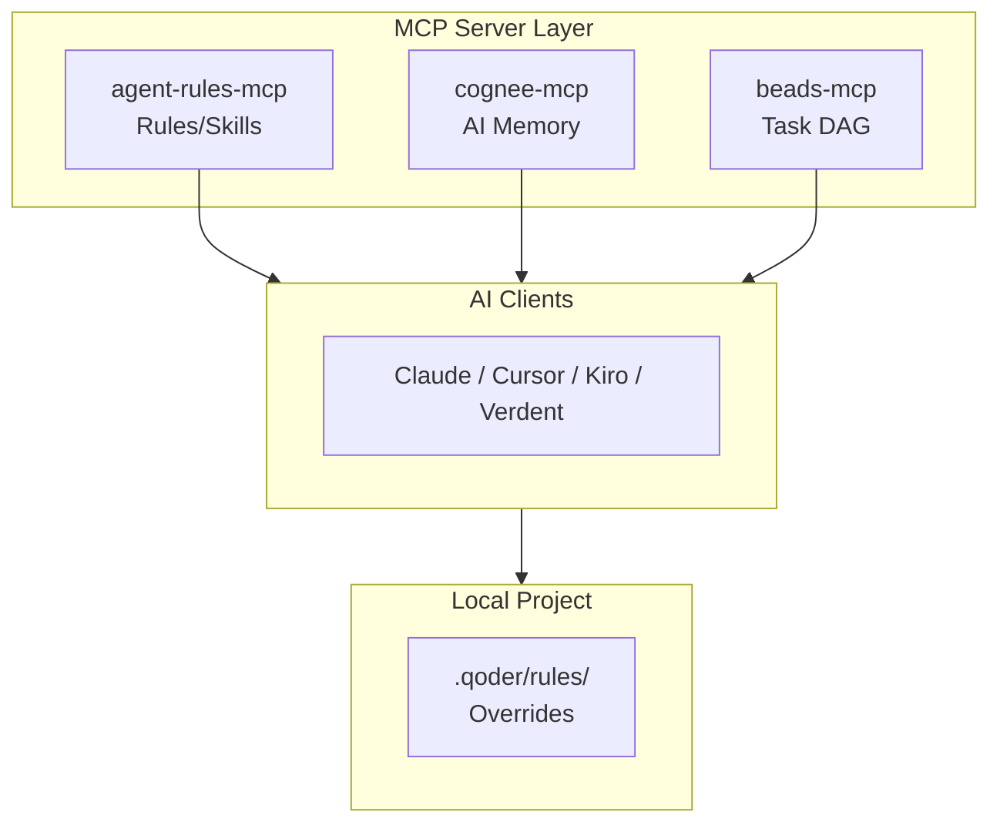

# AGENTS.md

This file provides guidance to Verdent when working with code in this repository.

## Quick Links

| Resource | Description |
|----------|-------------|
| [`rules/`](./rules/) | Core development rules (01-18) |
| [`skills/`](./skills/) | Reusable AI workflow templates |
| [`templates/`](./templates/) | Project templates (CLAUDE.md.template) |
| [`docs/`](./docs/) | Extended architecture documentation |
| [`CLAUDE.md`](./CLAUDE.md) | Repository conventions |
| [`README.md#regel-übersicht`](./README.md#-regel-übersicht) | Rule table |

## Table of Contents
1. Scope
2. Commonly Used Commands
3. High-Level Architecture & Structure
4. Key Rules & Constraints
5. Development Hints

## Scope

This repository is a **documentation and configuration system** for AI-assisted development. It contains no executable application code. AI clients (Claude, Cursor, Kiro, Verdent) consume this content via MCP servers to apply consistent development rules across projects.

## Commands

No build/lint/test commands exist - this is a documentation repository.

| Command | Purpose | Requirements |
|---------|---------|--------------|
| `npx -y agent-rules-mcp@latest` | Test MCP server locally | Node.js 18+, serves rules from configured GitHub repo |
| `bd ready --json` | Show actionable tasks | [Beads CLI](https://github.com/steveyegge/beads) |
| `bd create "Task" -p 1` | Create new task with priority | Beads CLI |
| `bd close <task-id>` | Close completed task | Beads CLI |
| `bd sync && git push` | Mandatory session end sync | Beads CLI + Git |

### Beads Installation

```bash
# Review script before executing (security best practice)
curl -fsSL https://raw.githubusercontent.com/steveyegge/beads/main/scripts/install.sh -o install-beads.sh
less install-beads.sh  # Inspect script
bash install-beads.sh
```

**Alternative:** Build from source - see [Beads repository](https://github.com/steveyegge/beads)

### Beads Workflow Examples

```bash
# List ready tasks
bd ready --json

# Create task with priority and dependencies
bd create "Implement UserCard" -t feature -p 1
bd create "Write tests" -t task -p 2 --deps "blocks:bd-a1b2c3"

# Close task with reason
bd close bd-a1b2c3 --reason "Implemented and tested"

# Session end - MANDATORY before closing
bd sync
git add . && git commit -m "session: [summary]"
git push

# Error: forgot to sync before push
# Fix: run `bd sync` then retry push
```

## Architecture

### Subsystems & Responsibilities
- **[rules/](./rules/)** - Core development rules (01-18), served via agent-rules-mcp to AI clients
- **[skills/](./skills/)** - Reusable AI workflow templates (creation/, analysis/, transformation/, integration/)
- **[templates/](./templates/)** - Project templates ([CLAUDE.md.template](./templates/CLAUDE.md.template) for memory files)
- **[docs/](./docs/)** - Extended architecture documentation

### MCP Server Layer



**ASCII Fallback (non-Mermaid environments):**
```
┌─────────────────────────────────────────────────────────────┐
│                    MCP SERVER LAYER                         │
│  ┌────────────────┐  ┌────────────┐  ┌────────────┐        │
│  │ agent-rules-mcp│  │ cognee-mcp │  │ beads-mcp  │        │
│  │  Rules/Skills  │  │  AI Memory │  │  Task DAG  │        │
│  └───────┬────────┘  └─────┬──────┘  └─────┬──────┘        │
└──────────┼─────────────────┼───────────────┼────────────────┘
           │                 │               │
           ▼                 ▼               ▼
┌─────────────────────────────────────────────────────────────┐
│              AI CLIENTS (Cursor, Claude, Kiro, Verdent)     │
└──────────────────────────────┬──────────────────────────────┘
                               │
                               ▼
┌─────────────────────────────────────────────────────────────┐
│  LOCAL PROJECT: .qoder/rules/ (Overrides)                   │
└─────────────────────────────────────────────────────────────┘
```

### External Dependencies

| Package | Purpose | Tools/API |
|---------|---------|-----------|
| **agent-rules-mcp** | Serves rules/skills from GitHub via MCP | `list_rules()`, `get_rules(domain)` |
| **cognee-mcp** | Persistent AI memory via knowledge graph | `cognify`, `codify`, `search`, `prune` |
| **beads-mcp** | DAG-based task tracking | `bd create`, `bd ready`, `bd close`, `bd sync` |

**Compatibility:**
- MCP clients: Cursor, Claude Desktop, Kiro, Windsurf (requires MCP protocol support)
- Node.js: 18+ for agent-rules-mcp
- The `"disabled": true` flag in MCP config is supported (see [`mcp-config-full.json`](./mcp-config-full.json))

### Data Flow
1. MCP servers expose rules/skills/memory/tasks to AI clients
2. AI clients apply rules during development sessions
3. Local `.qoder/rules/always/` overrides global rules per-project

### Override Precedence (highest to lowest)
1. **Local `.qoder/rules/always/`** - Project-specific auto-apply rules
2. **Local `.qoder/rules/manual/`** - On-demand via @rule command
3. **MCP-served rules** - Global rules from this repository

**Collision behavior (convention):** When local and global rules share the same name, the local rule takes precedence. The exact merge/replace behavior depends on the MCP client implementation; this repository assumes full replacement.

## Key Rules & Constraints

### From [CLAUDE.md](./CLAUDE.md)
- **Language:** Rule and skill files use German (repository convention)
  - Exceptions: Code examples, external references, and technical terms may use English
- **Metadata header required:** Last Updated, Description, Version
- **Rule structure:** Kernprinzip → Sections → Checkliste
- **Cross-references:** Use `[NN-rule-name]` format (e.g., `[02-atomic-components]`)
- **Skills:** Follow template structure from [`rules/15-skills-system.md`](./rules/15-skills-system.md)

### Session Lifecycle

Defined in [`rules/16-hooks-automation.md`](./rules/16-hooks-automation.md) (source of truth):

**Start:**
1. Context laden - Cognee-Search für Projekt-Status
2. `bd ready --json` für offene Tasks
3. Letzte 5 Commits lesen
4. Kontext zusammenfassen

**During:** Apply rules, update task status, save patterns to Cognee

**End ("Land the Plane" - MANDATORY):**
1. Work dokumentieren: `bd create` for remaining, `bd close` completed
2. Sync: `bd sync && git add . && git commit && git push`
3. Memory: Neue Patterns in Cognee speichern
4. Verify: `git status` (must be clean), `bd ready --json` for next session

### Strong Emphasis Words
- Rules use **WICHTIG/NIEMALS/IMMER** (IMPORTANT/NEVER/ALWAYS) for critical patterns
- AI should acknowledge which rules are being applied before complex implementations

## Development Hints

### Adding a New Rule

1. Create `rules/NN-rule-name.md` with next available number
2. Use this skeleton:

```markdown
# [Rule Name]

- Last Updated: YYYY-MM-DD
- Description: [Kurzbeschreibung für list_rules()]
- Version: 1.0

## Kernprinzip

[Hauptprinzip in 1-2 Sätzen]

---

## [Section 1]

[Content]

---

## Checkliste

- [ ] Punkt 1?
- [ ] Punkt 2?
```

3. Update rule table in [README.md "Regel-Übersicht"](./README.md#-regel-übersicht)
4. Cross-reference from related rules using `[NN-rule-name]` format

### Adding a New Skill

1. Determine category: `skills/creation/`, `skills/transformation/`, `skills/analysis/`, or `skills/integration/`
2. Use skeleton from [`rules/15-skills-system.md`](./rules/15-skills-system.md):

```markdown
# [Skill Name]

- Last Updated: YYYY-MM-DD
- Description: [Einzeiler für Übersicht]
- Version: 1.0
- Dependencies: [Regel 01, Skill XY]

## Kontext
[Wann wird dieser Skill verwendet?]

## Voraussetzungen
[Was muss vorhanden sein?]

## Workflow
[Nummerierte Schritte]

## Templates
[Code-Vorlagen]

## Checkliste
- [ ] Schritt 1 erledigt?
```

3. Include clear inputs, outputs, and step-by-step instructions

### Modifying MCP Configuration

- [`mcp-config.json`](./mcp-config.json) - Minimal config (rules only)
- [`mcp-config-full.json`](./mcp-config-full.json) - Full config with Cognee + Beads
- Update both files when adding new MCP servers
- Paths and API keys must be customized per installation
- Set `"disabled": true` to temporarily disable a server (verified in config schema)

### Project-Specific Overrides

Create in target project (not this repo):

```
project/
└── .qoder/rules/
    ├── always/           # Auto-apply (highest precedence)
    │   └── overrides.md
    └── manual/           # On-demand via @rule
        └── hotfix.md
```

Local rules take precedence over MCP-served global rules with the same name.
